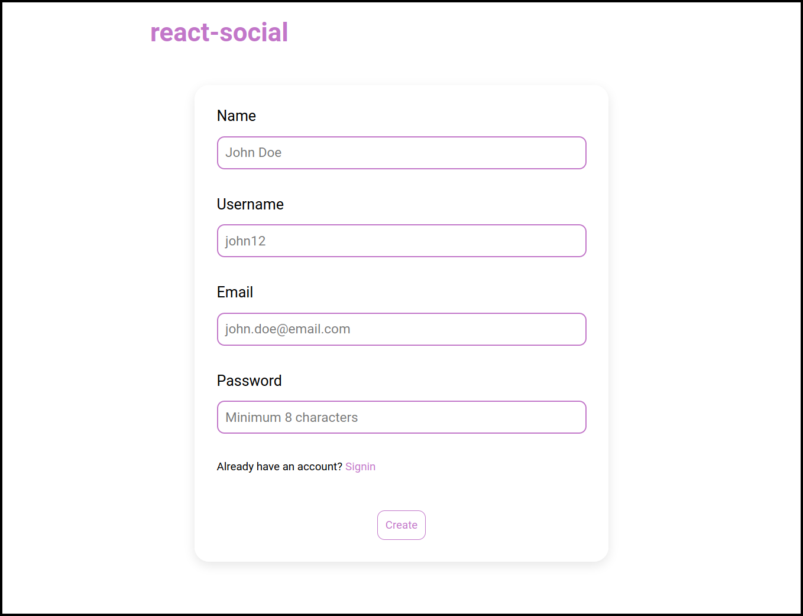
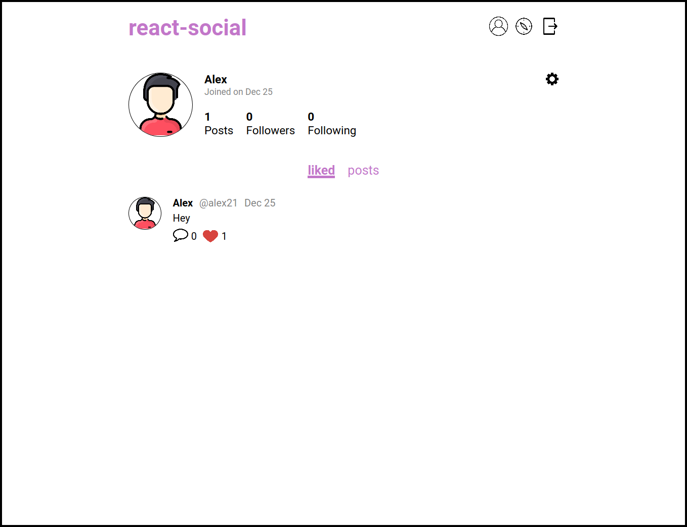
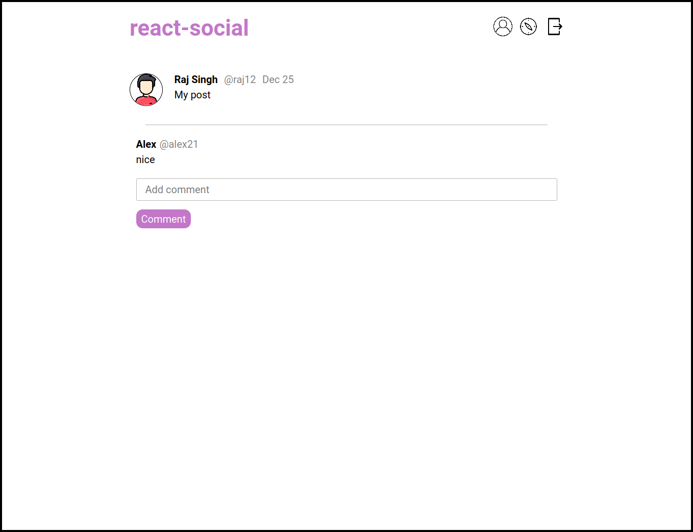

# react-social

A fullstack social media web app with basic features.

## Technologies used

Frontend: React  
Backend: Node.js, Express, MongoDB

## Features

* [x] Login and Signup
* [x] Add post
* [x] Comment on post
* [x] Like
* [x] Follow / Unfollow
* [x] See followers and following users
* [x] Change profile picture, password and about
* [x] Explore screen where posts by users which we are not following are displayed

## Todo

* [ ] Add more tests
* [ ] Post image

## Screenshots

### Login  


### Signup


### Home


### Profile


### Explore


### Comments


### Update


## Running the project

### Frontend

Create a file named .env at the root of the frontend directory with the following details
```
    REACT_APP_CLOUDINARY_URL = YOUR_URL_HERE
```
This is required as all the images are stored in cloudinary.
  
After that, run the following command
```
    npm install && npm start
```

### Backend

Create a file named .env at the root of the backend directory with the following details

```
    PORT = YOUR_PORT
    MONGO_URI = URI_FOR_PRODUCTION
    TEST_MONGO_URI = URI_FOR_TESTING
    DEV_MONGO_URI = URI_FOR_DEVELOPMENT
    SECRET = YOUR_JWT_SECRET
```
After that, run the following command
```
    npm install && npm run dev
```
